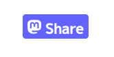

## シンプルMastodonシェアボタン



### 使い方

ブログやページのHTMLのシェアボタンを表示したい箇所に次のコードをコピペしてください:

```html
<a href="#" class="js-mstdn-share-button"></a>
<script defer src="https://github.com/windymelt/mastodon-share-button-scalajs/releases/latest/download/mstdn-share.js"></script>
```

最新バージョンは  です

### テンプレート文字列

以下のように書くとシェアするテキストをカスタマイズできます:

```html
<a href="#" class="js-mstdn-share-button">Share: {title} {}</a>
```

現在のところ、以下のプレースホルダをサポートしています:

- `{}` -- URLが入ります
- `{title}` -- そのページの`title`要素の中身が入ります

### ビルド

`sbt '~fastLinkJS'` を実行しつつ、`vite dev`を実行すると開発サーバが立ちます

`npm run build`を実行するとリリース用JavaScriptを生成できます

----

`sbt fastLinkJS`を使うと開発用JavaScriptを生成できます

`sbt fullLinkJS`を使うとリリース用JavaScriptを生成できます
